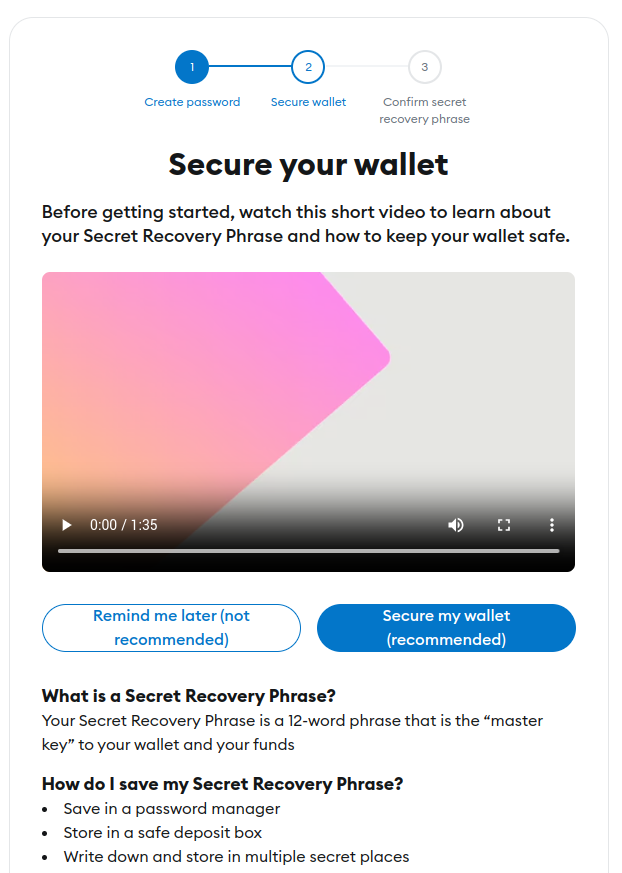
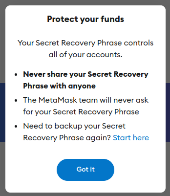

# Installing and configuring MetaMask

For this tutorial we will be using Google Chrome desktop browser
1. Install the [MetaMask browser extension](https://chromewebstore.google.com/detail/metamask/nkbihfbeogaeaoehlefnkodbefgpgknn)
2. Tick "I agree to MetaMask's Terms of use" and click "Create a new wallet"
   
   

3. Set your MetaMask wallet password, keep it to yourself. Then tick "I understand that MetaMask cannot recover this password for me. Learn more" and click "Create a new wallet" 

   

4. We will backup the wallet recovery seed later, so click on "Remind me later". Tick "I understand that until I back up my Secret Recovery Phrase" and click "Got It"

   

   

   

5. Keep clicking next until you complete the intro dialog then click "Got It"

   

6. Click on the extensions icon on the top right of your browser and pin the MetaMask plugin (the orange fox )
 
   

7. Click MetaMask icon on the top right side of the browser, enter password when required. On the top left of the dialog hover on the button with tooltip "Ethereum Network"
  
   

8. Click on "Add Network", click on "Polygon Mainnet", then click "Approve"

   

   

   

9. Click "Switch to Polygon Mainnet" and click "Got it"

   

   

10. Click "Import Tokens"

   

11. For each USDC, USDT, DAI and, WETH search and tick. Then click "Next"

   

   

   

   

12. Confirm importing USDC, USDT, WETH and DAI, click "Import"

   

13. Now you can accept payment in USDC, USDT, WETH and ETH via the Polygon Network. If you wish to accept payment through another network, for example Arbitrium One. You can click on the top left of the MetaMask dialog and add "Arbitrium One" then import the tokens

   

14. Copy your Wallet address and store it in the text editor. Click copy icon below the account name. We will be using this address later on when we are configuring the BoomFi merchant

   
