# Signing up and Configuring BoomFi merchant Account

We will be using [BoomFi test](https://app.boomfi.xyz/login) environment for this tutorial. If you wish to create a live account you can visit [BoomFi live](https://app.boomfi.xyz/login) environment.

1. Open Boomfi test environment for merchant account at https://test.boomfi.xyz/login
2. Click on "Sign Up", if you don't have the account
   
    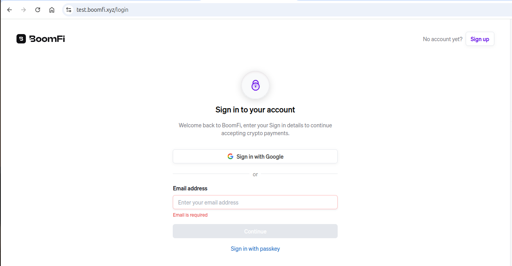

3. Enter your first name, last name, email address and optionally phone number. Tick accept term and condition and click "Create Account"

    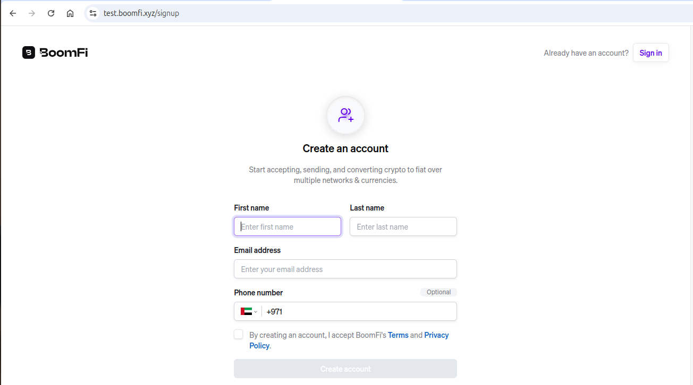

4. Enter OTP code from your email to confirm the email address

   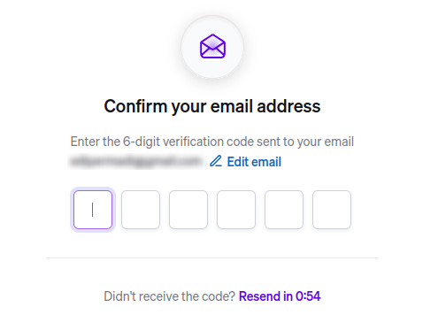

5. Enter Company name and other details and click "Open account"

   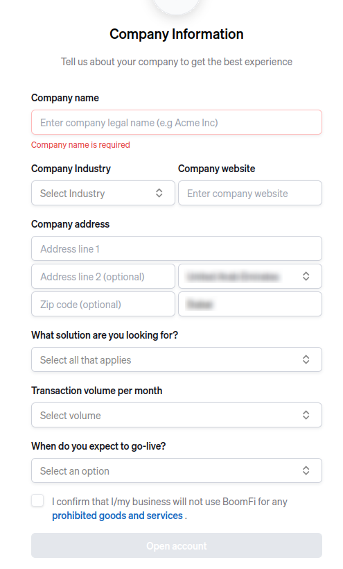

6. Now you have BoomFi merchant account. In production mode, you have to go through KYB process

   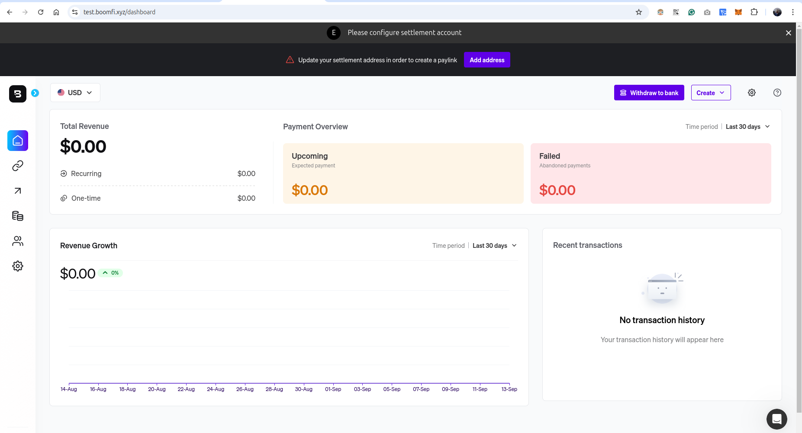

7. Click on the gear icon on the left side menu to go to the settings page

   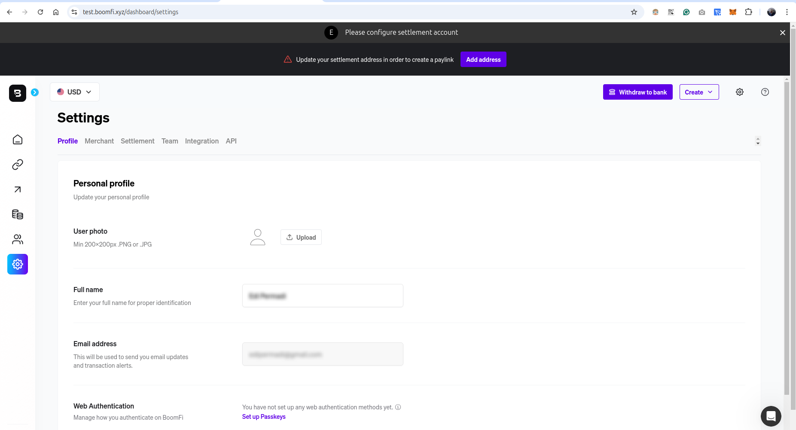

8. Click on "Settlement" tab to configure settlement wallet. In this step we will be using the wallet address created from the previous step while [installing and configuring MetaMask](01-installing-and-configuring-metamask.md)
   
   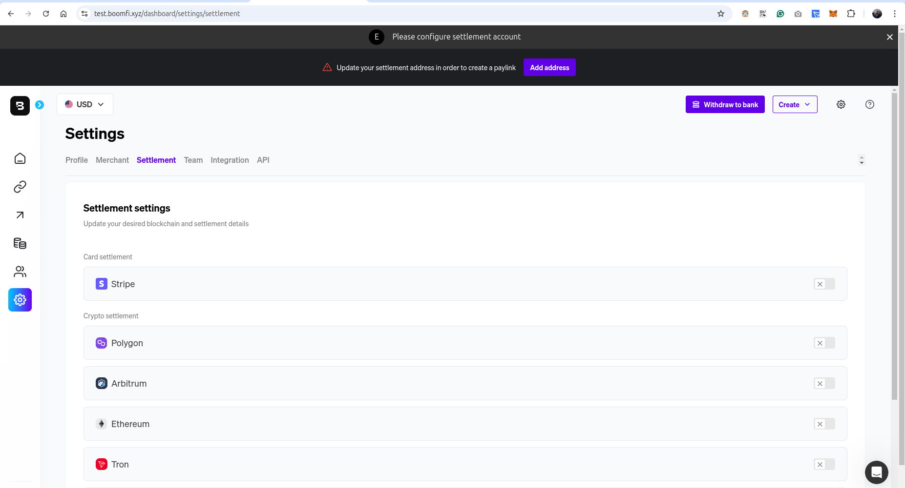

9. Since we only configured polygon network in the previous step. Toggle the slide switch of the polygon, enter the wallet address, tick USDC, USDT, WETH and DAI then click "Save"
  
   
   
   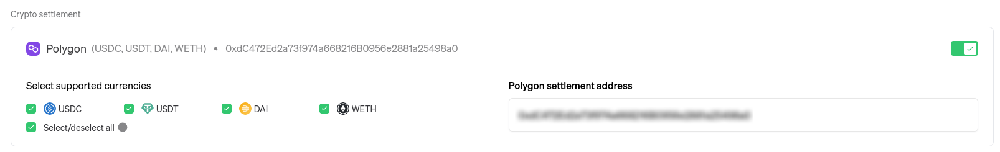

10. Click on the "Pay links" icon on the left side menu to navigate to payment link. Here we wil be creating a payment link that will be used by WooCommerce customer to check out and perform payment. Then click "Create Paylink"

   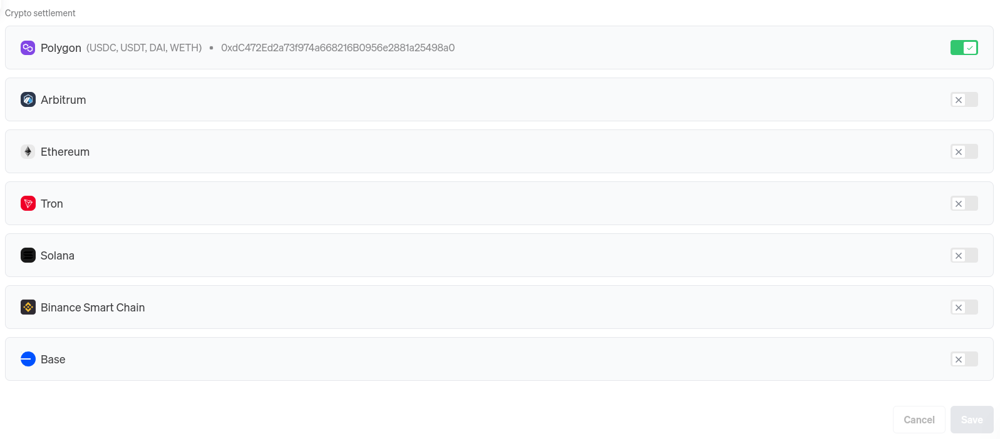

11. Name the paylink distinctive to WooCommerce, for example "WooCommerce payment". Set price to 1 USD, the actual price and currency will be overriden by `Boomfi Crypto Payments for WooCommerce` plugin. Make sure it's one time payment and tick "Allow repeat payments without confirmation" to make it reusable. Then click "Continue"

   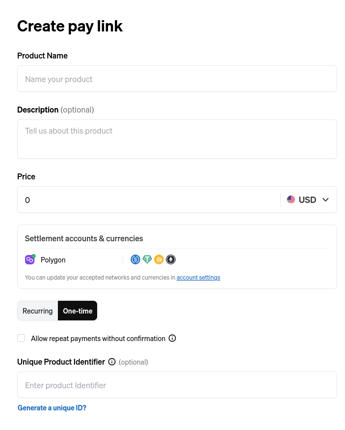

   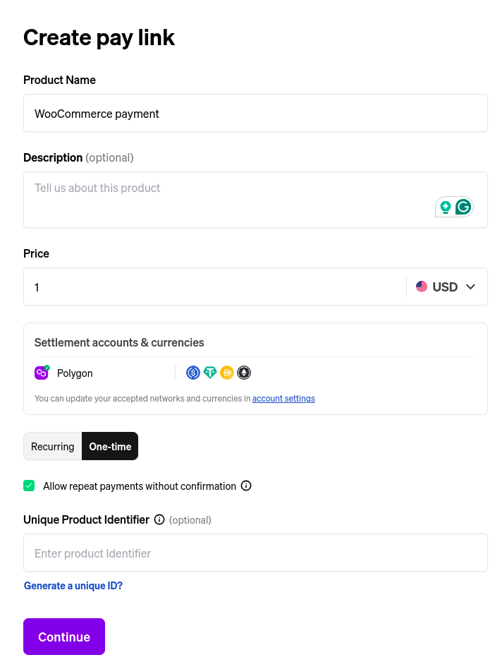

12. Copy the paylink address, we will be using it to configure "BoomFi Crypto Payments for WooCommerce" later on

   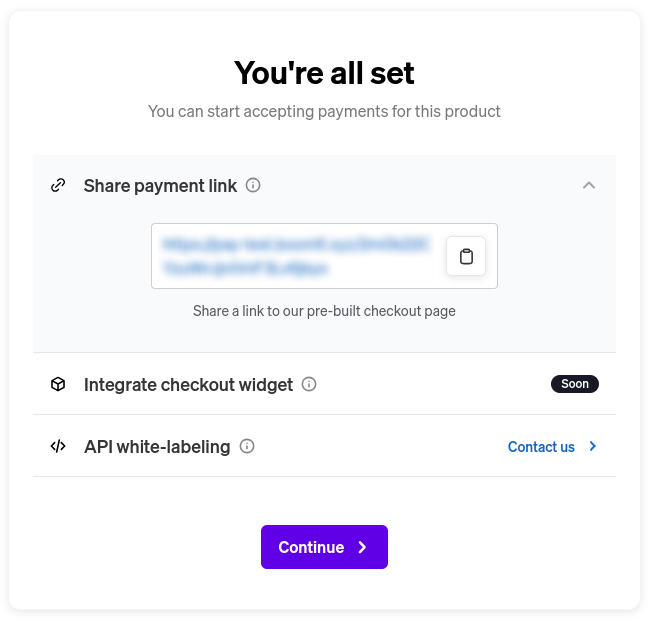

13. Click on gear icon on the left side menu to navigate to settings page then click "API", then click "Create API Key"

   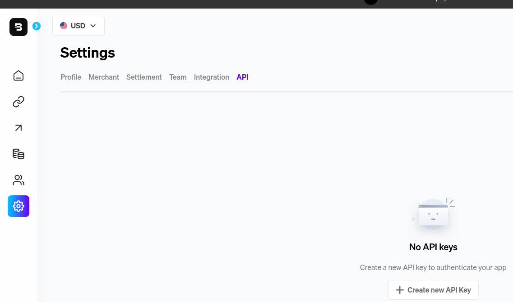

14. Name API key and save the API key value somewhere safe. We will be using it to configure "BoomFi Crypto Payments for WooCommerce" later on

   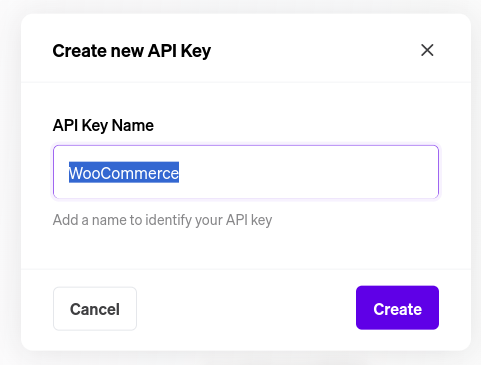
   
   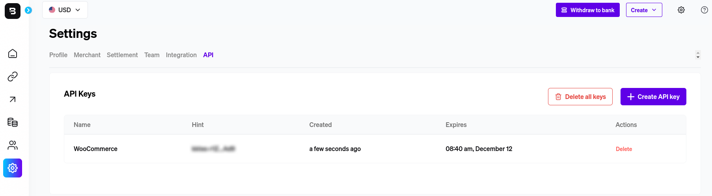