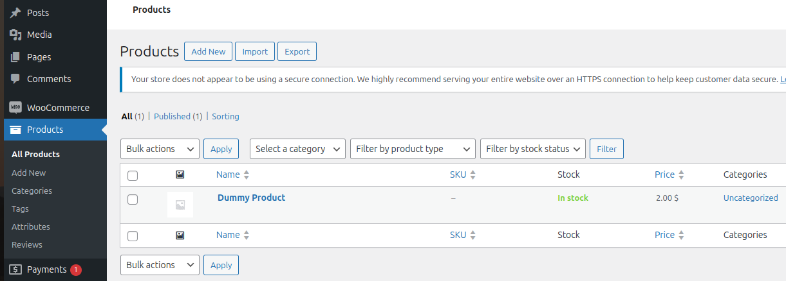
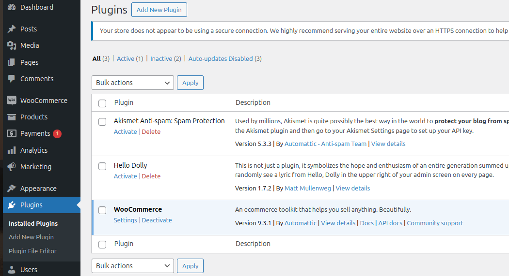
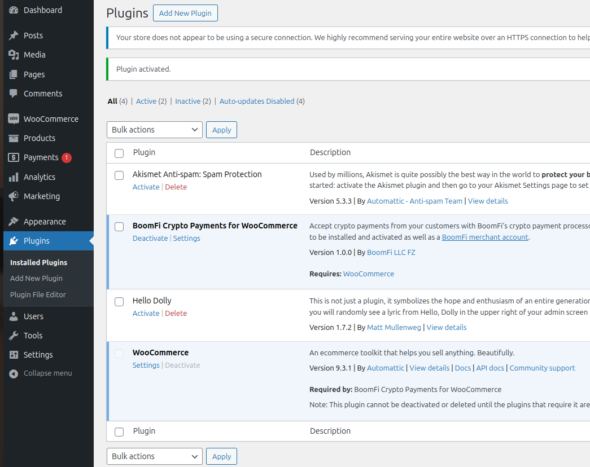
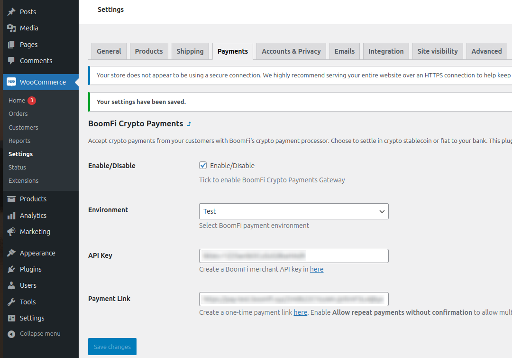

# Installing and configuring Boomfi Crypto Payments for WooCommerce plugin

We will be installing `BoomFi Crypto Payments for WooCommerce` and configuring it with the payment link and API Key that we created in [previous step](02-signing-up-and-configuring-boomfi-merchant-account.md)

1. Have your wordPress and WooCommerce installed and configured
2. Add a dummy product to WooCommerce, set the price to 2 USD

    

3. Install `BoomFi Crypto Payments for WooCommerce` plugin or upload the zip file into your WordPress admin

   

   

4. Click "Settings" on the "BoomFi Crypto Payments for WooCommerce" section
   1. Tick "Enable/Disable"
   2. Select "Test" environment
   3. Paste API key from the previous step when we were [configuring BoomFi merchant account](02-signing-up-and-configuring-boomfi-merchant-account.md)
   4. Paste Payment Link from the previous step when we were [configuring BoomFi merchant account](02-signing-up-and-configuring-boomfi-merchant-account.md)
   5. Click "Save Changes"

   