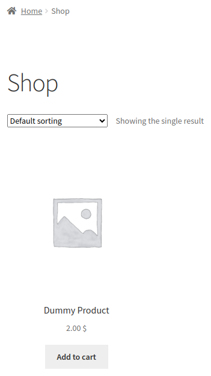
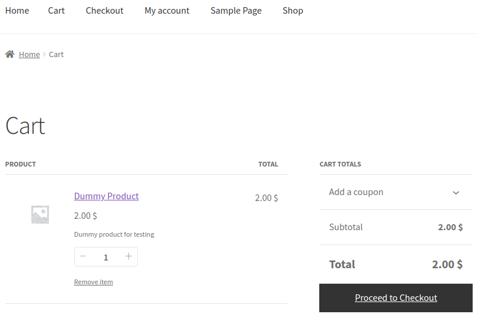
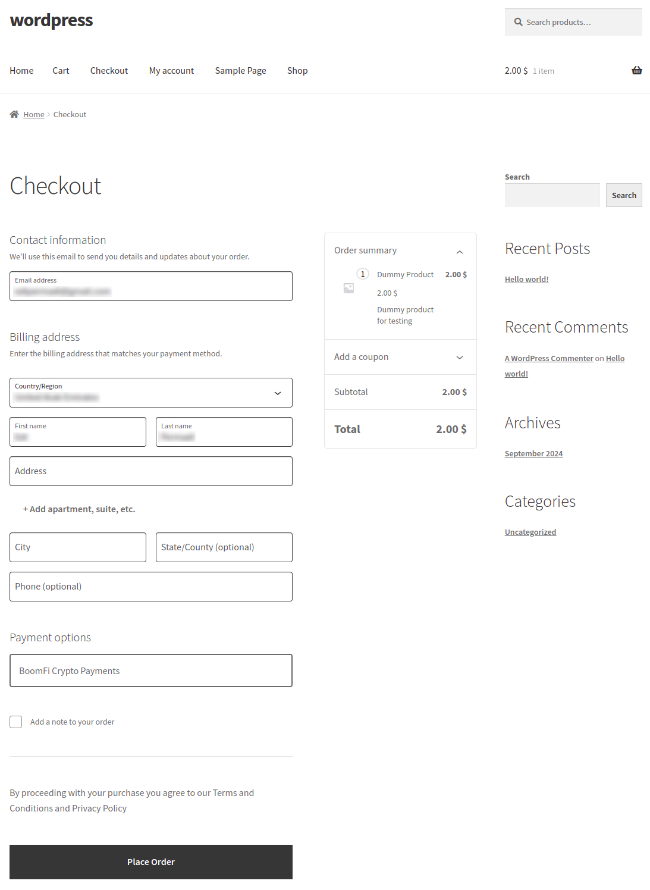
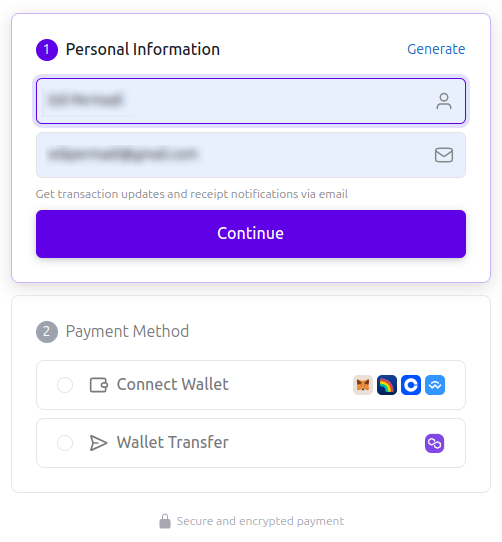
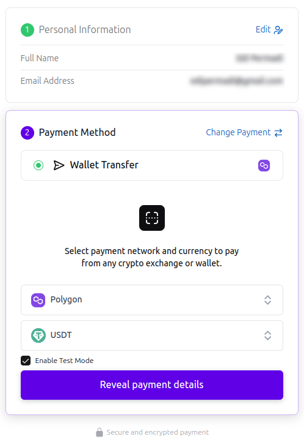
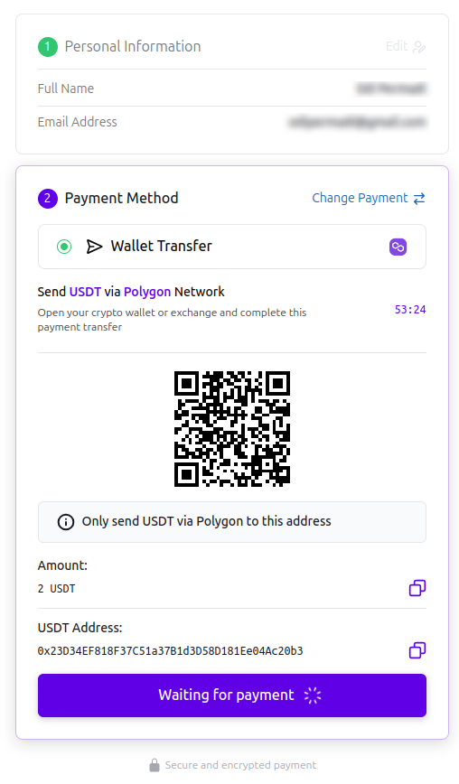
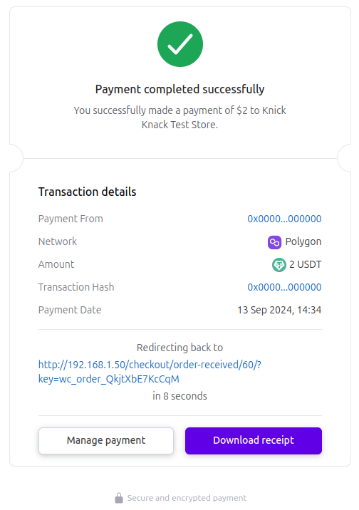
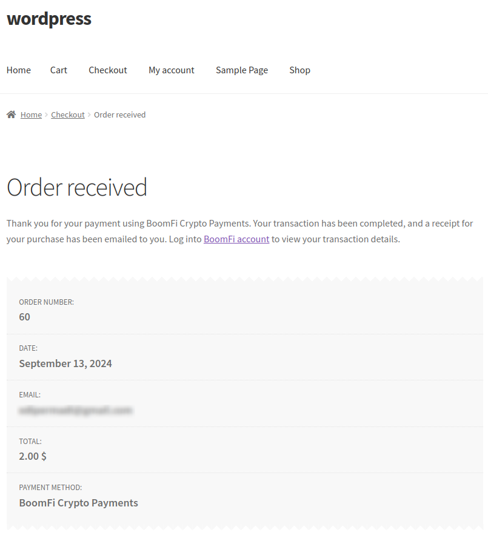
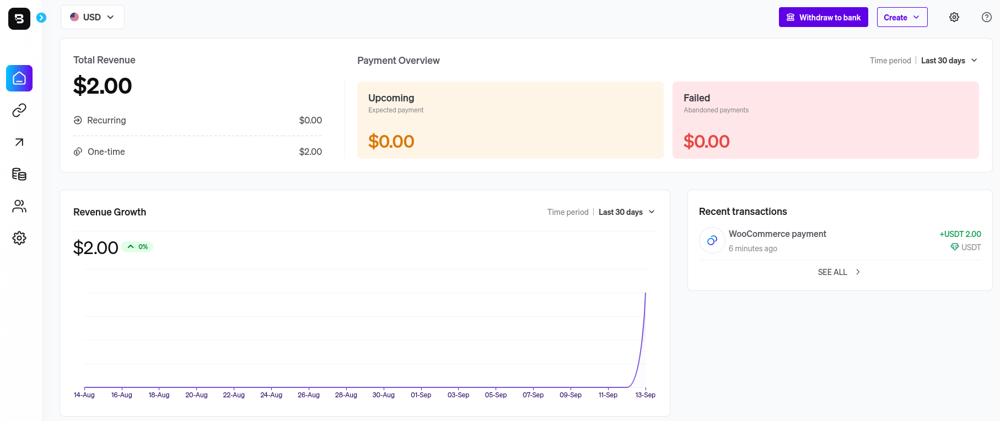
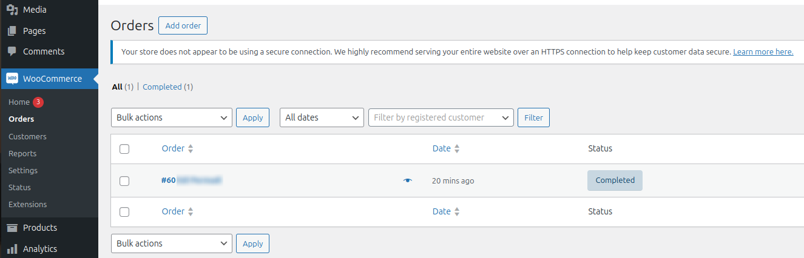

# Payment Testing

In this section we will be simulating an action done by a customer and later on checking the order in WooCommerce and BoomFi merchant portal to track transaction

## Checkout flow as Customer

1. Open the WordPress shop section
   1. click "Add to Cart" on the "Dummy Product" listing
   2. Click "View Cart"
   3. Click "Proceed to Checkout"

   

   

2. Fill in Payment Details then click "Place Order", make sure "BoomFi Crypto Payments" is selected as the payment option

   

3. In the BoomFi checkout page, fill in customer name and email address then click "Continue"

   

4. Then following steps

   1. Select "wallet Transfer"
   2. Chose "Polygon"
   3. Chose "USDT"
   4. Tick "Enable Test Mode" to simulate payment.
   5. Click Reveal payment details

   

   After Selecting "Wallet Transfer"

   

5. Wait until payment completed

   

6. Finally user will be redirected back to the original WordPress eCommerce site

   

## Verifying payment as Merchant

1. Login to [BoomFi Test](https://test.boomfi.xyz) using the email used previously when signing up as a new merchant. You will see all the transactions there

   

2. Login to WordPress as admin, then click "Orders" on WooCommerce section

   
